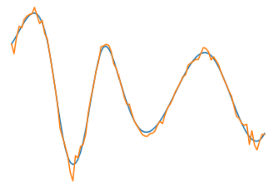

# Генераторы Python #

## Генератор ##

Генератор создает объект, который используется для итерирования, при
этом он генерирует по одному элементу и не хранит их в памяти после
итерирования. Фактически сгенерировав объект, происходит переход к
следующему, предыдущие в памяти не хранятся.


*Генератор* `range ()`

```Python
generator = (i for i in range (5))
print (generator)
for item in generator:
    print (item)
```

## Yield ##

Функция выполняется до первого `yield`, генерирует объект и при
следующем исполнении начинает с того места, где завершился последний
выполненный `yield`

```Python
def fgenerator(n) :
    print ("start")
    for i in range (n):
        print ("in cycle")
        yield i
    yield 100
    print ("between")
    yield 200
    print ("end")

p = fgenerator (5)

for i in p:
    print (i)
print (list (p))
```

*Результат*

```
start
in cycle
0
in cycle
2
in cycle
3
in cycle
4
100
between
200
end
[]
```

После перебора генератор больше ничего не возвращает, список остался
пустым

--- 

Если поменять порядок вызова генератора, увидим, что после перебора
генератора, элементов в нем для перебора не останется, а список
заполнится значениями

```Python
def fgenerator (n):
    print ("start")
    for i in range (n):
        print ("in cycle")
        yield i
    yield 100
    print ("between")
    yield 200
    print ("end")

p = fgenerator (5)

print (list (p))
for i in p:
    print (i)
```

*Результат*

```
start 
in cycle
in cycle
in cycle
in cycle
in cycle
between
end
[0,1,2,3,4,100,200]
```

---

`return` прерывает итерацию генератора

```Python
def fgenerator (n):
    print ("start"):
    for i in range (n):
        if (i>5):
            return
        print ("in cycle")
        yield i
    yield 100
    print ("between")
    yield 200
    print ("end")

p = fgenerator (7) # Будет каждый раз срываться при итерации > 5

print (list (p))
```

*Результат*

```
start
in cycle
in cycle
in cycle
in cycle
in cycle
in cycle
[0,1,2,3,4,5]
```

## Примеры ##

### Генерация случайных чисел больше 0.5 ###

Конечно, можно `0.5+random()*0.5`, но как пример для возможного
создания более сложных генерируемых объектов.

```Python
from random import *

def frandom (n):
    i = 0
    while i<n:
        x = random()
        if x>0.5
            i=i+1
            yield x

print (len (list (frandom (100))))
print (list (frandom (100)))
```

### Генерация случайного гладкого сигнала ###

```Python
from math import *
from random import *
import numpy as np
import matplotlib.pyplot as plt
from scipy.interpolate import UnivariateSpline

def func (n):
    nw = int (n/(random ()*10+2))
    w = (np.random.rand (nw)-0.5)*2
    x = np.linespace (-1, 1, nw)
    spl = UnivariateSpline (-1, 1, n)
    xs - np.linespace (-1, 1, n)
    ws = spl (xs)
    return ws

def funcgener (size, n):
    for i in range (size):
        yield func (n)


n = 100
res = [it for it in funcgener (10, n)]
print (len (res))
    
x = np.linespace (-1, 1, n)
y = func (n)

err = np.random.randn (n)
yerr = y+err*0.1*y
plt.plot (x, y)
plt.plot (x, yerr)
plt.show ()
```


